## Solicitudes 4, 16 y 17 — Prototipo local de reservas, 9 de octubre de 2026

**Preparado para revisión, no publicado.** Nuevo diseño: sesión → zona/fecha/hora de ejemplo → datos de ejemplo → resumen. Horario de Miami. Clínicas con plazas de ejemplo y cálculo por jugador. El pago está desactivado; no se envían datos ni se realizan reservas.

**Pendiente:** conectar el flujo real de Acuity, confirmar canchas/horarios, conectar Stripe y aprobar políticas. El prototipo no consulta disponibilidad real. Las cuatro sesiones ya están creadas como privadas en Acuity; las fechas de clínicas aún no están configuradas.

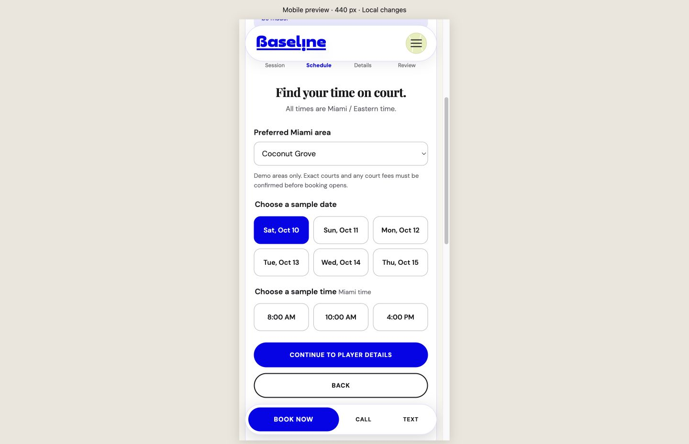
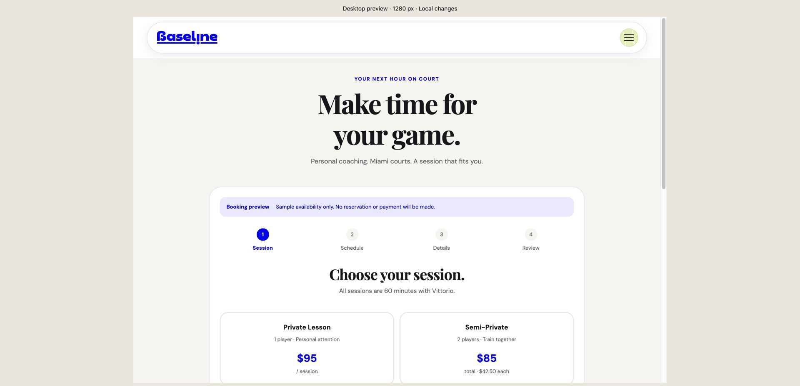

## Actualización: imagen al compartir el enlace — 4 de octubre de 2026

Se configuraron las 13 páginas para mostrar el logo azul de Baseline sobre fondo crema al compartir el enlace, en lugar de una foto de cancha. Algunas aplicaciones pueden conservar temporalmente la imagen anterior en su caché. Las fotos dentro del sitio no cambian.

## Actualización aprobada para GitHub — 4 de octubre de 2026

Esta nota reemplaza las menciones “solo local” de los cambios visuales anteriores incluidos en esta versión.

1. Encabezado flotante y redondeado en las 13 páginas, con menú hamburguesa.
2. Enlaces del menú centrados; accesos a secciones del inicio dentro del menú. Se eliminó la barra separada “On this page”.
3. Botón del menú con color suave de pelota de tenis y líneas curvas decorativas.
4. Animación sutil al pasar el cursor o pulsar; se respeta la preferencia de movimiento reducido.
5. Botones de acción redondeados y consistentes; tarjetas de clases con esquinas suaves y botones alineados.
6. Barra móvil flotante y redondeada: Book Now / Call / Text.
7. Revisión de enlaces, archivos, JavaScript, reservas de prueba y navegación. Se corrigió el foco del teclado al saltar a una sección.

**Pendiente:** elegir y configurar reservas/pagos. Acuity + Stripe es una opción recomendada, todavía sin conexión. Faltan horarios, canchas exactas, tiempos de traslado, reglas de grupos y políticas finales. Primero reservas sin cuenta obligatoria; cuentas opcionales después. Chat también pendiente. No se cobran pagos ni se confirman reservas reales.

**Documento para enviar:** este registro se actualizó; el PDF anterior aún necesita capturas nuevas de los cambios recientes.

# Baseline Tennis Coach Request Review

## Revisión móvil adicional — 2 de octubre de 2026

9. **Explorar desde tarifas:** las cuatro tarjetas de sesiones incluyen un enlace secundario Explore a la página de su categoría, debajo del botón de reserva/disponibilidad. Solo local.

8. **Paquete integrado:** la oferta de 10 clases por $850 ($85/clase, ahorro de $100) ahora usa la misma tarjeta que Tennis 101/201 y aparece debajo de esos programas. Se retiró la sección independiente. Términos y vencimiento siguen pendientes del coach. Solo local.

7. **Tarjetas de programas:** contenido centrado, ancho máximo de 320 px en móvil; dos columnas en tablet y tres en escritorio, con alturas iguales y enlaces alineados. Solo local.

6. **Orden de contenido y navegación:** sesiones/programas/paquetes → ubicaciones → coach → reseñas (ocultas hasta recibir testimonios reales) → fotos/video → beneficios/apoyo/Why Tennis. Menú sincronizado con los cinco grupos visibles. Cambios locales; publicación pendiente.

5. **Navegación por secciones:** menú “On this page” con seis enlaces directos; Book Now permanece separado. Al elegir un enlace, el menú se cierra y navega a la sección. Solo local, pendiente de aprobación.

4. **Separación de secciones:** fondos blancos y crema alternados para sesiones, reseñas, coach y galería. Títulos más grandes y centrados; espaciado uniforme. Se conserva la tipografía y el azul de Baseline. Prueba local pendiente de aprobación.

3. **Orden actualizado por Ron:** Private Lesson → Semi-Private → Sparring / Hitting Session → Group Clinics. Sustituye la indicación anterior de conservar el orden original. Solo local.

2. **Tarjetas de sesiones centradas:** nombres, jugadores, duración y precios centrados en las cuatro opciones. Tarjetas móviles más compactas (máximo 320 px), centradas bajo el título. Cambio local pendiente de aprobación.

1. **Hero simplificado:** se quitaron los botones Book Now y View Rates debajo de “Private Tennis Lessons in Miami”. Las acciones de reserva siguen en la navegación, la barra fija móvil y las tarjetas de sesiones. Cambio local, pendiente de revisión; no publicado.

> **Fotos recibidas:** las fotos reales de retrato y juego en cancha ya reemplazan los placeholders en Home y About. Las notas anteriores de fotos pendientes y sus capturas muestran versiones previas. Siguen pendientes reseñas, cifras verificadas y aprobación de la biografía.

> **Actualización vigente:** se eliminó la reserva por email. Los botones ahora llevan a un placeholder de reserva con el programa elegido hasta conectar el proveedor. Las menciones anteriores al formulario o contacto para reservar describen versiones anteriores y ya no aplican. El email sigue disponible solo como contacto general.

This running review connects Coach Vittorio's requests with the changes made to the Baseline Tennis website. The changes below are saved in the local preview and have not been published. The final email-ready PDF will include mobile screenshots demonstrating each completed item.

Todas las solicitudes 1–17 incluyen una captura móvil del estado actual. Las imágenes muestran la versión acumulada, no comparaciones antes/después. Los pendientes se indican en cada pie de imagen.

## Overall objective

Coach's request: “no solamente se vea premium, sino que esté diseñado principalmente para CONVERTIR visitantes en clientes que reserven y paguen.”

Desired journey: discover Baseline → understand the offering → trust the coach → see pricing → see availability → book → pay → receive confirmation.

Progress: the booking language and homepage explanation have been updated. Live availability, payments, and automatic confirmation still require a booking provider. They are not represented as completed by these design changes.

## Request 1 Make booking the main action

### Evidencia visual · Solicitud 1

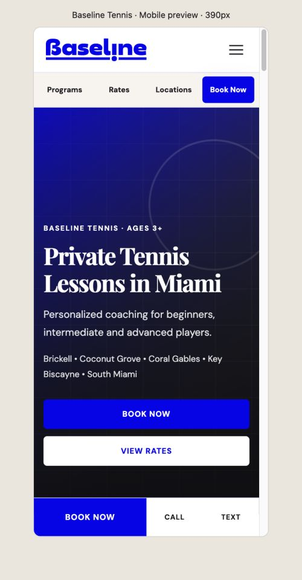

BOOK NOW es la acción principal.

### What the coach requested

“Quiero cambiar el CTA principal de: ‘Request a Lesson’ a algo mucho más directo como: BOOK A LESSON o BOOK NOW.”

“La acción principal en prácticamente todo el website debería ser reservar, no pedir información.”

### What changed

- Homepage main and closing buttons now say BOOK A LESSON.
- Shared desktop header and footer booking links use Book a Lesson.
- Booking choices use direct wording such as Book a Private Lesson, Book a Sparring Session, and Book a Clinic.
- Compact mobile controls retain the short label Book.
- The approved colors, typography, and scrolling navigation remain intact.

The version inspected before this request already used Book a Session on the homepage and Book Online in the header. Those were standardized; Request wording was also present in the booking choices and was updated. This distinction preserves an accurate before-and-after record.

### Status and demonstration

Implemented in the local preview. Homepage visually reviewed; wording changes saved in version history.

Final PDF evidence: mobile homepage showing BOOK A LESSON, and booking-page choices showing the new action labels. Capture fresh screenshots from the final reviewed version before export.

Remaining dependency: the buttons currently lead through the existing booking/contact fallback. The site still explains that live scheduling and payment are pending. The contact form accurately retains Prepare Email Request.

## Request 2 Explain the service location and player levels immediately

### Evidencia visual · Solicitud 2

El hero explica clases privadas, Miami y niveles de juego.

### What the coach requested

“Quiero que el hero explique inmediatamente qué ofrece Baseline y dónde.”

Requested wording:

PRIVATE TENNIS LESSONS IN MIAMI

Personalized coaching for beginners, intermediate and advanced players.

Brickell • Coconut Grove • Coral Gables • Key Biscayne • South Miami

The visitor should immediately understand the offering, service area, intended players, and how to book.

### What changed

- Replaced Build a Better Game, One Clear Step at a Time with Private Tennis Lessons in Miami.
- Added the requested beginner, intermediate, and advanced player description.
- Added all five requested neighborhoods directly below the description.
- Positioned BOOK A LESSON below this information, with View Rates as the secondary action.
- Retained the Ages 3+ information and approved brand styling.

### Status and demonstration

Implemented and visually checked at phone width in the local preview. The headline, player description, neighborhood list, and booking action are visible together in the reviewed mobile hero.

Final PDF evidence: one mobile hero screenshot with annotations identifying what, where, who, and booking action. Capture from the final reviewed version before export.

## Additional approved usability improvement

Before the coach's numbered requests, Ron approved a persistent homepage bar linking to Programs, Rates, Locations, and Book. It supports quick navigation while retaining the existing mobile Book, Call, Text, and Email controls. This is a separately approved improvement, not a numbered coach request.

## Remaining requests and final delivery

Request 3 was subsequently supplied and implemented below. Request 4 has not yet been supplied.

Continue this record as each request arrives. For each item, preserve the original wording, describe the actual change, record verification, and identify any pending dependency. Do not mark local implementation as published or treat a button label as proof of completed booking functionality.

When the coach's requirements are complete, produce an email-ready PDF with the requests, concise English explanations, and current mobile screenshots. Mark any outstanding work and publication status explicitly. Supply the PDF for Ron to email; do not send it automatically.

## Request 3 Show prices directly on the homepage

### Evidencia visual · Solicitud 3

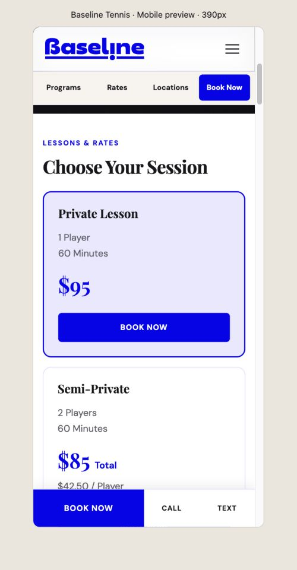

Precios visibles en Choose Your Session; las demás opciones siguen debajo.

### What the coach requested

“MOSTRAR LOS PRECIOS DIRECTAMENTE EN EL HOME” and “No quiero que alguien tenga que entrar en varias páginas para descubrir cuánto cuesta una clase.”

Directly after the hero: CHOOSE YOUR SESSION with Private Lesson (1 player, 60 minutes, $95, Book Now), Semi-Private (2 players, 60 minutes, $85 total, $42.50/player, Book Now), Group Clinics (up to 4 players, 60 minutes, $42.50/player, View Clinics), and Sparring / Hitting Session (60 minutes, $120, Book Now).

### What changed

Moved session pricing from below the program overview to directly after the hero. Created the four requested cards in the requested order with prominent prices and full-width mobile buttons. Private, semi-private and sparring buttons lead to the booking page; View Clinics leads to the clinic page. Existing lesson packages remain unchanged farther down the homepage.

Updated the semi-private rate from $90 total/$45 per player to $85 total/$42.50 per player, and clinics from $45/90 minutes to $42.50/60 minutes. Updated corresponding detail pages, booking choices, homepage summaries, and relevant search metadata to avoid conflicting prices.

### Status and demonstration

Implemented locally. All four options and prices verified in the mobile page structure. Final PDF evidence: mobile pricing cards showing player count, duration, price and action. Actual scheduling and payment still await provider integration.

## Solicitud 4 Reservar y pagar en línea

### Evidencia visual · Solicitud 4

Flujo previsto. Reservas y pagos automáticos todavía pendientes.

### Lo que pediste

Elegir programa → elegir lugar → elegir fecha y hora → datos del jugador → pagar → recibir confirmación. La meta es: BOOK → PAY → DONE.

### Lo que ya está listo

- Los botones están preparados para conectar el sistema que elijas.
- Al elegir una clase, el formulario conserva la opción correcta.
- Por ahora, el cliente envía un correo. La página explica que todavía no hay pago ni reserva automática.
- El diseño de Baseline sigue igual. Los cambios están guardados, pero no publicados.

### Mi recomendación

Primero probar Setmore con Stripe. La página actual de Setmore ofrece un plan gratis con pagos por Stripe. Algunas páginas antiguas dicen otra cosa; confirmaremos las funciones al crear la cuenta. Setmore permite clases con cupos, útil para clínicas de cuatro jugadores.

Stripe cobra normalmente 2.9% + $0.30 por pago con tarjeta nacional de EE. UU. Ejemplo: una clase de $95 tiene una comisión aproximada de $3.06. Pueden aplicar otros cargos según la tarjeta o el servicio. Gratis significa sin mensualidad del plan básico, no sin comisión de tarjeta.

Si Setmore no maneja bien tus horarios y lugares, probar Acuity con Stripe. Acuity empieza en $20 al mes, o $16 al mes pagando un año. El plan con hasta seis calendarios cuesta $34 al mes, o $27 al mes pagando un año. Estos importes no incluyen las comisiones por pago ni impuestos aplicables.

No contrataría un plan anual antes de probar una reserva completa desde el celular. Para un solo entrenador que se mueve entre canchas, debemos evitar reservas al mismo tiempo y dejar tiempo para viajar. Setmore maneja sus ubicaciones separadas con cuentas distintas; hay que comprobar que esa organización te sirva.

### Lo que necesitamos de ti

1. ¿Tienes canchas y horarios garantizados, o debes confirmar la cancha después de cada solicitud?
2. ¿Qué lugares y horarios quieres ofrecer? ¿Cuánto tiempo necesitas entre clases para trasladarte?
3. ¿Ya tienes Stripe, Square u otro sistema de reservas?
4. Para semi-private, proponemos un pago de $85 por los dos jugadores. Para clínicas, cada jugador paga $42.50 y hay cuatro cupos. ¿Está bien?

### Lo que falta

Elegir el sistema, abrir o conectar la cuenta, configurar horarios y canchas, y probar pago y confirmación. También debemos probar que no haya doble reserva y que la clínica cierre al llegar a cuatro jugadores. El calendario del entrenador no garantiza por sí solo la disponibilidad de una cancha.

Estado: preparación técnica terminada; reservas y pagos en línea pendientes. No se ha creado ninguna cuenta, contratado ningún plan ni conectado pagos.

### English summary

Booking links are prepared and program selection is fixed. Live booking and payment are not active. Test Setmore + Stripe first for low cost; consider Acuity + Stripe if scheduling needs require it. Confirm court access, working hours, travel time and existing accounts before activation.

### Fuentes de precios y funciones

- Setmore: https://www.setmore.com/pricing
- Clases y cupos: https://www.setmore.com/features/class-booking
- Ubicaciones: https://www.setmore.com/features/multiple-locations
- Acuity: https://www.acuityscheduling.com/pricing
- Stripe: https://stripe.com/pricing

Confirmar precios y funciones al activar el servicio. En el PDF final, mostrar la pantalla móvil de reserva y mantener este paso marcado como pendiente hasta probar el proceso completo.

## SEO Cómo ayudamos a que encuentren Baseline en Google

SEO significa preparar la web para que Google entienda qué ofreces y pueda mostrarla a las personas que buscan clases de tenis.

### Lo que ya estamos haciendo

- El inicio dice claramente Private Tennis Lessons in Miami y menciona las zonas donde trabajas.
- Cada página tiene su propio título y una descripción del servicio. Revisamos las 12 páginas.
- Cada programa tiene una página propia: clases privadas, semi-private, clínicas, sparring, Tennis 101 y Tennis 201.
- Los enlaces del inicio describen el destino, por ejemplo Explore Private Lessons, en lugar de decir solamente Details.
- Los precios y duraciones actualizados coinciden entre las páginas relacionadas.
- El contenido principal está escrito en la página y puede leerse sin depender de un sistema de reservas externo.
- Revisamos primero la experiencia móvil: texto legible, navegación y botones fáciles de usar.
- Ya existe un mapa de las 11 páginas principales para buscadores. La página de error no está incluida.

### Lo que falta antes del lanzamiento

- Confirmar el dominio definitivo. Las direcciones para buscadores usan por ahora baselinetennis.com; todavía debemos confirmar que sea el dominio correcto.
- Activar la indexación solamente al publicar la versión final aprobada. La versión de prueba contiene instrucciones para no aparecer en buscadores; esto no funciona como una contraseña ni garantiza privacidad.
- Configurar Google Search Console y enviar el mapa del sitio con el dominio confirmado.
- Revisar los datos estructurados del negocio según los lugares reales donde trabajas. No agregaremos direcciones, reseñas ni credenciales inventadas.
- Si corresponde, crear o revisar Google Business Profile con tus datos reales y zonas de servicio. No presentar cada barrio como si fuera una sede propia.
- Cuando tengamos fotos y videos: usar archivos livianos, descripciones útiles y revisar la velocidad desde el celular.
- Medir visitas desde Google y reservas después del lanzamiento. Todavía no hemos medido resultados, posiciones en Google ni velocidad en condiciones reales.

La meta es que más personas adecuadas encuentren Baseline y puedan reservar. Nadie puede garantizar el primer lugar en Google.

### English summary

SEO is a standing priority. Current foundations include service-and-location copy, unique titles and descriptions, descriptive internal links, separate service pages, consistent rates, mobile-first review and a sitemap. Production indexing, Search Console, verified business details and media performance checks remain launch tasks. No ranking or traffic improvement is claimed yet.

Sources: https://developers.google.com/search/docs/fundamentals/seo-starter-guide ; https://developers.google.com/search/docs/crawling-indexing/block-indexing ; https://support.google.com/business/answer/3038177 .

## Solicitud 5 Elegir sesión después del hero

### Evidencia visual · Solicitud 5

Choose Your Session está colocado inmediatamente después del hero.

Esta solicitud confirma lo pedido en el punto 3. Ya está hecha: Choose Your Session aparece justo después del hero con los cuatro servicios, precios y botones. No duplicamos la sección.

## Solicitud 6 Reseñas y testimonios reales

### Evidencia visual · Solicitud 6

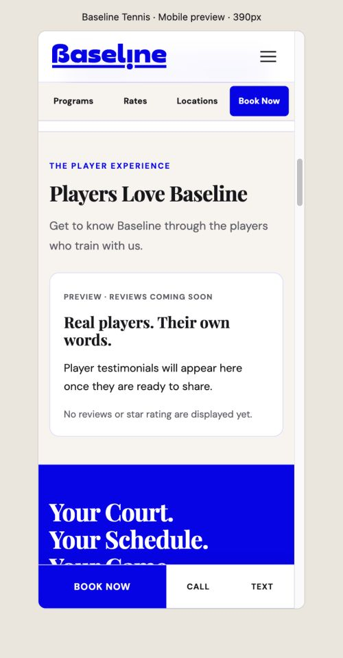

Sección preparada. Faltan reseñas reales; no se muestran testimonios inventados.

### Lo que pediste

“PLAYERS LOVE BASELINE” con Google Reviews reales y testimonios para que los nuevos visitantes tengan más confianza antes de pagar.

### Lo que preparamos

Agregamos una sección después de los precios llamada Players Love Baseline, con el mismo diseño de la marca y adaptada al celular. Por ahora muestra claramente que las reseñas están pendientes. No inventamos testimonios, nombres, estrellas ni cantidad de reseñas.

### Lo que necesitamos de ti

- El enlace de Google Reviews de Baseline, si ya existe.
- Dos o tres testimonios reales que podamos mostrar, con el texto exacto y el nombre que el cliente permite publicar.
- Para testimonios enviados en privado, confirmar que el cliente autoriza publicarlos. No incluir datos personales innecesarios.

### Estado

Diseño preparado; contenido real pendiente. No hay integración automática con Google ni valoración verificada. Antes de publicar, reemplazar el aviso por testimonios reales aprobados, o retirar temporalmente esta sección. El título es una propuesta de diseño, no una medición de satisfacción.

En el PDF final, incluir una captura móvil y distinguir claramente entre diseño preparado y reseñas publicadas. Los puntos 7 y 8 llegaron vacíos; todavía no se han implementado.

## Solicitud 7 La propuesta de valor de Baseline

### Evidencia visual · Solicitud 7

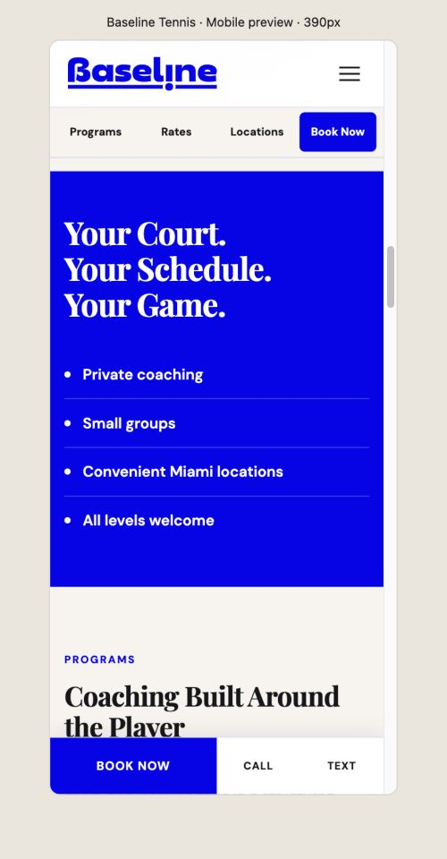

Propuesta de valor y beneficios de Baseline.

### Lo que pediste

“YOUR COURT. YOUR SCHEDULE. YOUR GAME.” con cuatro puntos: Private coaching, Small groups, Convenient Miami locations y All levels welcome. Comunicar comodidad y experiencia con poco texto.

### Lo que hicimos

Creamos una sección azul con el título en tres líneas y los cuatro puntos exactos. Reemplaza la pequeña franja de beneficios anterior, después de la sección de reseñas y antes de los programas. Así mantenemos la página clara, sin repetir otra franja. Los precios siguen directamente después del hero.

### Estado

Implementado en la versión local y revisado en vista móvil. El estilo, los colores y las letras de Baseline se conservan. La frase comunica la propuesta de la marca; no significa que cualquier cancha u horario esté disponible. La disponibilidad real sigue pendiente de configurar en el sistema de reservas.

Para el PDF final: incluir una captura móvil con el título y los cuatro beneficios juntos. Solicitud 8 todavía pendiente de recibir.

## Solicitud 8 Miami como enfoque principal de SEO

### Evidencia visual · Solicitud 8

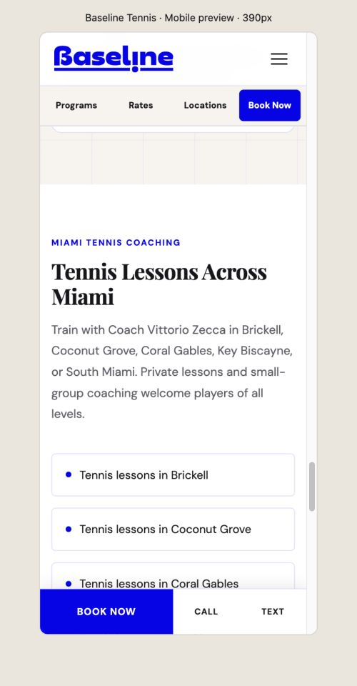

Miami y sus zonas principales ganan protagonismo. La captura no demuestra posicionamiento en Google.

### Lo que pediste

Dar prioridad a Miami sobre South Florida. Enfocar la web en clases privadas, entrenador de tenis y clases de tenis en Miami, Brickell, Coconut Grove, Coral Gables, Key Biscayne y South Miami.

### Lo que hicimos

- Revisamos la versión actual: ya no tenía menciones de South Florida en las páginas del sitio.
- Reforzamos Miami en los títulos principales de clases privadas, semi-private, clínicas, sparring y reservas.
- La página del entrenador ahora dice Your Tennis Coach in Miami y su título de búsqueda identifica a Vittorio Zecca.
- El inicio mantiene Private Tennis Lessons in Miami y su título de búsqueda dice Tennis Lessons in Miami.
- La sección de zonas destaca las cinco áreas solicitadas con enlaces claros para reservar o conocer las clases privadas. Conservamos las otras zonas atendidas como información secundaria.
- No creamos páginas repetidas por barrio ni direcciones de canchas sin confirmar. Cada página mantiene su título y descripción propios.

### Estado

Implementado en la versión local. Revisado en móvil y comprobados los títulos y enlaces. Es preparación para SEO; no significa que ya estemos apareciendo en Google ni garantiza posiciones. La indexación de la versión final sigue pendiente de la aprobación de lanzamiento.

Para el PDF final: captura de la sección móvil Tennis Lessons Across Miami, mostrando las cinco zonas prioritarias.

## Solicitud 9 Correo de la marca

### Evidencia visual · Solicitud 9

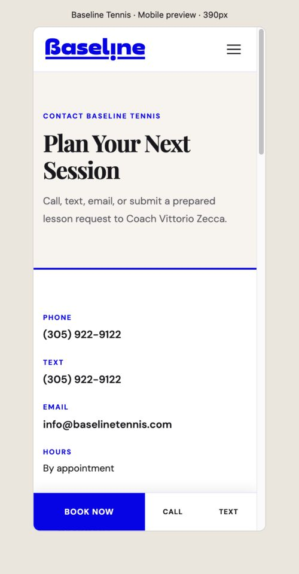

Correo visible de la marca. Falta verificar recepción de mensajes.

### Lo que pediste

Cambiar el Gmail personal por info@baselinetennis.com para que la comunicación del sitio use la marca Baseline.

### Lo que hicimos

Actualizamos el correo visible, los enlaces Email del pie de página y del menú móvil, el destino del formulario que prepara correos y los datos del negocio para buscadores. El cambio se aplica a todas las páginas.

### Estado

Implementado localmente y revisado en la vista móvil. Falta confirmar que info@baselinetennis.com exista y pueda recibir mensajes antes de publicar. Cambiar la web no crea la casilla de correo. No enviamos mensajes de prueba ni modificamos el proveedor de correo.

Para el PDF final: captura de la página de contacto con el correo de Baseline.

## Solicitud 10 Botón fijo para reservar en el celular

### Evidencia visual · Solicitud 10

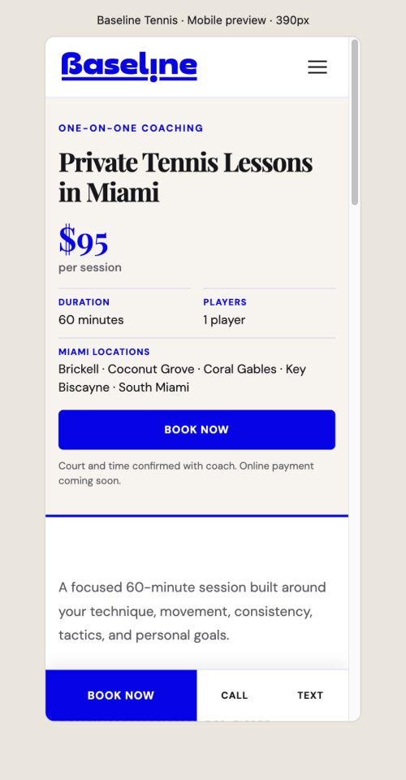

Barra fija con BOOK NOW principal y Call/Text secundarios.

### Lo que pediste

Un botón BOOK NOW siempre visible abajo de la pantalla. Call o Text como opciones secundarias. Reservar debe ser la acción principal.

### Lo que hicimos

La barra inferior ahora dedica la mitad de su ancho a BOOK NOW, en azul. Call y Text ocupan espacios más pequeños a su lado. Quitamos Email de esta barra para mantener el foco; el correo sigue en Contact y en el pie de página.

Aplicamos el cambio a las 12 páginas, incluidas todas las páginas de programas y servicios. La barra sigue fija al desplazarse y deja espacio para la zona inferior de los teléfonos compatibles. En pantallas grandes se mantiene la navegación de escritorio.

### Estado

Implementado localmente y revisado en móvil. BOOK NOW abre la página de opciones de sesión; las reservas y pagos automáticos siguen pendientes del proveedor. Guardado de forma reversible, sin publicar.

Para el PDF final: captura móvil con BOOK NOW como botón principal y Call/Text como secundarios. El texto PROGRAM / SERVICE PAGES parece ser el encabezado del siguiente grupo de instrucciones; todavía no contiene una solicitud adicional.

## Solicitud 11 Precio y reserva al inicio de cada programa

### Evidencia visual · Solicitud 11

Ejemplo de Private Lessons: información de compra antes de los detalles.

### Lo que pediste

Mostrar primero nombre, precio, duración, cantidad de jugadores, zonas y BOOK NOW en Private, Semi-Private, Clinics, Tennis 101 y Tennis 201. Dejar los beneficios y explicaciones debajo.

### Lo que hicimos

Las cinco páginas ahora empiezan con un resumen claro y un botón grande BOOK NOW. Conservamos el diseño de Baseline y movimos la introducción debajo. Private muestra $95, 60 minutos y 1 jugador. Semi-Private muestra $85 total ($42.50 por jugador), 60 minutos y 2 jugadores. Clinics muestra $42.50 por jugador, 60 minutos y hasta 4 jugadores. Las cinco zonas principales de Miami aparecen arriba; cancha y horario se confirman con el coach.

### Falta confirmar

Tennis 101 conserva la duración publicada de 4–6 semanas y Tennis 201 la de 6 semanas. No encontramos precios, duración de cada clase ni cantidad de jugadores confirmados para estos programas. Mostramos esos datos como pendientes, sin inventar precios ni aplicar tarifas de otros servicios. Necesitamos los datos del coach para finalizar estas dos ofertas.

### Estado

Preparado localmente, con revisión móvil y enlaces de reserva por programa comprobados. Los botones usan la conexión preparada en la solicitud 4; los pagos automáticos todavía no están activos. Cambios reversibles, sin publicar. Cada página conserva un solo título principal y texto accesible para buscadores; añadimos Miami al título visible de Tennis 101 y 201.

English summary: All five service pages now lead with purchase essentials and a program-specific Book Now button. Tennis 101/201 pricing, session length and player limits still need coach confirmation.

Para el PDF final: captura móvil del resumen de Private y de Tennis 101/201 una vez confirmados los datos pendientes.

## Solicitud 12 CTAs simples y consistentes

### Evidencia visual · Solicitud 12

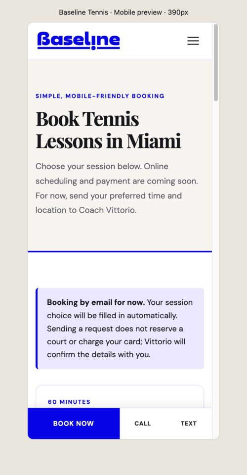

Página de reservas con acciones unificadas; otros botones aparecen al desplazarse.

### Lo que pediste

Simplificar las llamadas a la acción a BOOK NOW, VIEW AVAILABILITY y, como opción secundaria, ASK A QUESTION.

### Lo que hicimos

Unificamos los botones de reserva de todas las páginas, encabezados, pies y programas con BOOK NOW. Los enlaces mantienen el programa seleccionado. La tarjeta de clínicas del inicio ahora dice VIEW AVAILABILITY y lleva a Upcoming Clinics, donde se explica que el calendario sigue pendiente. ASK A QUESTION se mantiene como opción secundaria de contacto.

Conservamos el orden original del coach: Private, Semi-Private, Group Clinics y Sparring. Los enlaces informativos (por ejemplo View Rates y los nombres del menú) conservan etiquetas que describen su destino. El botón final del formulario sigue diciendo Prepare Email Request porque actualmente prepara un correo; no confirma ni cobra una reserva.

### Estado

Implementado localmente y revisado en móvil. No hay disponibilidad en tiempo real ni pago activo hasta conectar el proveedor. Guardado de forma reversible, sin publicar.

English summary: Booking CTAs now use Book Now throughout. The homepage clinic CTA uses View Availability and leads to the pending clinic schedule. Ask a Question remains the secondary contact action. Original session order retained.

Para el PDF final: captura móvil de Choose Your Session y del botón de reserva de un programa.

## Solicitud 13 Retirar el paquete de 5 clases

### Evidencia visual · Solicitud 13

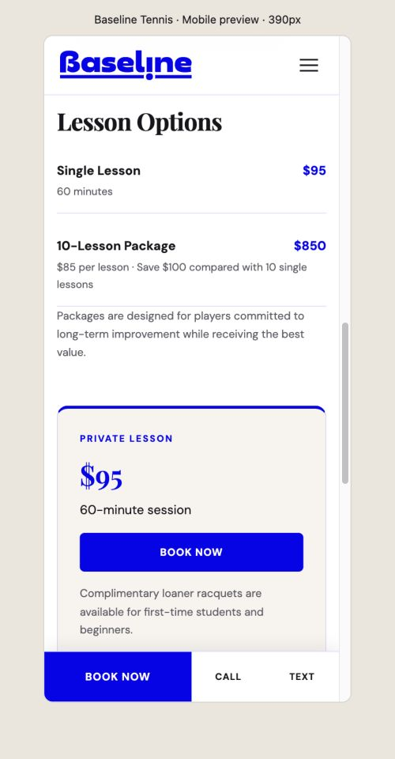

Se retiró el paquete de cinco. El de diez muestra precio y ahorro.

### Lo que pediste

Quitar por ahora Package of 5 de Private Lessons. Si se ofrecen paquetes después, presentarlos como productos claros con precio y ahorro definidos.

### Lo que hicimos

Retiramos el paquete de 5 clases de Private Lessons, del inicio y de la respuesta de preguntas frecuentes para mantener la información consistente. Conservamos Single Lesson a $95 y la oferta existente de 10 clases a $850. Esta última ahora muestra $85 por clase y $100 de ahorro frente a 10 clases individuales de $95. Ajustamos el diseño para no dejar un espacio vacío.

### Estado

Cambio local y reversible, sin publicar. No agregamos nuevos paquetes. Antes de vender paquetes online, el coach debe confirmar las condiciones y el proveedor debe permitir comprarlos y usar las clases. El paquete de 5 queda retirado hasta una decisión posterior.

English summary: Removed the 5-lesson package throughout visible site content. Retained the existing $850 ten-lesson option and clarified its $100 savings against ten $95 single lessons.

Para el PDF final: captura móvil de Lesson Options en Private Lessons.

## Solicitud 14 Clínicas de grupos pequeños

### Evidencia visual · Solicitud 14

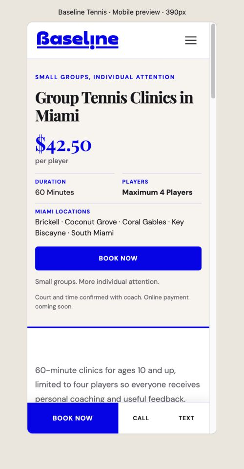

60 Minutes y Maximum 4 Players destacados.

### Lo que pediste

Dejar claros 60 Minutes y Maximum 4 Players, usando el límite de cuatro como beneficio de grupos pequeños.

### Lo que hicimos

Destacamos Maximum 4 Players en la oferta principal de Group Clinics, en las tarjetas del inicio y en la página de reservas. La duración de 60 Minutes aparece junto a la información de compra. Añadimos el beneficio: grupos pequeños, más atención individual. Conservamos el precio de $42.50 por jugador y el orden de las sesiones.

### Estado

Implementado y revisado en móvil. Este texto comunica el límite del servicio; al conectar reservas, el proveedor debe configurarse para impedir más de cuatro plazas por clínica. Guardado localmente, sin publicar.

English summary: Maximum 4 Players and 60 Minutes are prominent across clinic offers. Small-group coaching and individual attention are highlighted. The future booking system must enforce the four-player limit.

Para el PDF final: captura móvil del inicio de Group Clinics.

## Solicitud 15 Tennis 101 y Tennis 201 como programas

### Evidencia visual · Solicitud 15

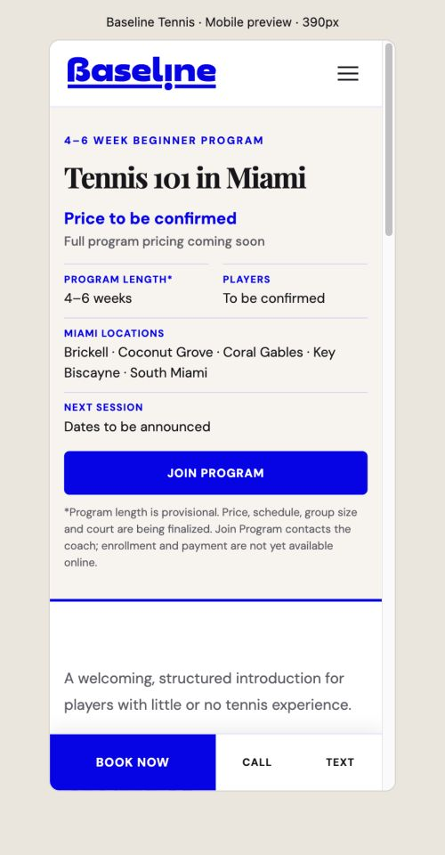

Tennis 101 como programa. Precio, fechas y otros detalles pendientes.

Tennis 201 usa el mismo formato de programa; los datos finales siguen pendientes.

### Lo que pediste

Conservar ambos programas y presentarlos como productos: nombre, duración, precio, próxima sesión y JOIN PROGRAM. Los detalles definitivos llegarán por separado.

### Lo que hicimos

Las dos páginas muestran el espacio de precio del programa completo y Next Session con fechas pendientes. Los botones propios de estos programas ahora dicen JOIN PROGRAM, también en la página de reservas. Se mantienen los beneficios debajo de la oferta. El botón fijo general sigue siendo BOOK NOW.

### Datos pendientes del coach

Precio total, duración definitiva en semanas, cantidad y duración de clases, máximo de jugadores, fecha de inicio, días y horarios, cancha y condiciones de inscripción. El ejemplo de 6 semanas para Tennis 101 no se tomó como confirmación: por ahora conservamos las 4–6 semanas existentes, marcadas como provisionales. Tennis 201 conserva sus 6 semanas, también sujetas a confirmación.

### Estado

Presentación preparada y revisada en móvil. JOIN PROGRAM abre el contacto con el programa elegido; todavía no inscribe ni cobra. Se conectará al proveedor cuando estén definidos los productos. Guardado localmente, reversible y sin publicar. BOOKING / STRIPE se interpreta como encabezado de las próximas instrucciones.

English summary: Both programs now feature full-program price placeholders, next-session dates pending, and Join Program actions. Final product details will come separately; existing durations are explicitly provisional. Online enrollment/payment is not yet active.

Para el PDF final: captura móvil de Tennis 101 y Tennis 201 con su oferta de programa.

## Solicitudes 16 y 17 Reserva y pago en un solo flujo

### Evidencia visual · Solicitud 16

Flujo previsto; Stripe y los emails automáticos todavía no están conectados.

### Evidencia visual · Solicitud 17

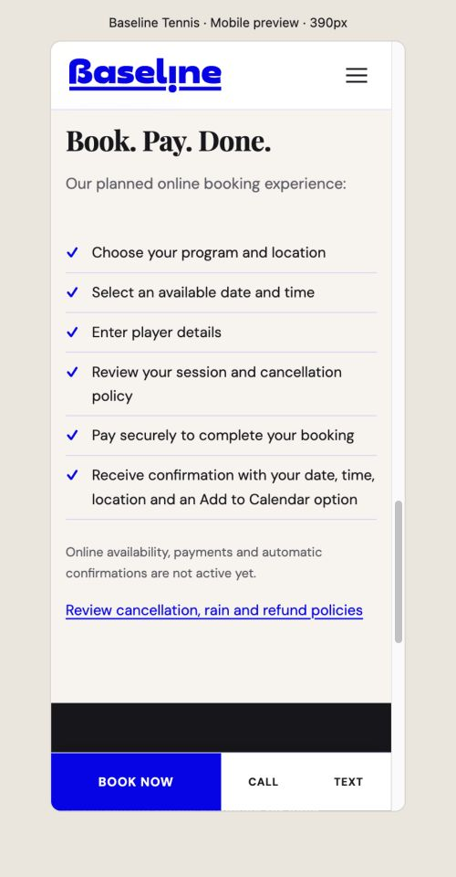

Objetivo de un solo flujo. La integración del proveedor sigue pendiente.

### Lo que pediste

BOOK → PAY → DONE. Después del pago: confirmación al cliente, aviso al coach, fecha/hora/lugar claros, política de cancelación y Add to Calendar. Se puede combinar un sistema de reservas con Stripe.

### Recomendación sencilla

Usar un sistema de reservas conectado a Stripe. El sistema maneja horarios, plazas y avisos; Stripe procesa el pago. Acuity + Stripe es una opción adecuada para probar: permite exigir el pago completo al reservar y ofrece confirmaciones con información de la cita e invitación de calendario. Esto no requiere construir un sistema propio de reservas. La comparación de costos de la solicitud 4 sigue siendo una referencia; hay que verificar el plan y precio al elegir. No hemos contratado ningún servicio.

El objetivo es que el cliente elija programa → cancha → horario disponible → datos → revise política → pague → reciba confirmación. Puede hacerse en la página del proveedor con la marca Baseline y sin volver a un formulario por correo. La integración del proveedor con Stripe puede usar su propio formulario de pago; no necesariamente el producto independiente Stripe Checkout.

### Preparado en el sitio

Los botones ya tienen una conexión por programa para llevar al proveedor elegido. Actualizamos la explicación del flujo previsto en Booking y añadimos un enlace a las políticas. La página indica claramente que las reservas, pagos y confirmaciones automáticas todavía no están activos. No agregamos un botón de pago sin un horario reservado.

### Qué debe incluir la confirmación

Programa, nombre del cliente, fecha, hora de inicio y final, zona horaria de Miami, cancha y dirección exacta, importe pagado y referencia de reserva. Incluir la política de cancelación y lluvia, cómo contactar o cambiar la reserva y Add to Calendar. El coach recibe la misma información de la reserva. Su aviso debe llegar al correo que confirme; verificar primero info@baselinetennis.com. El proveedor puede enviar desde su propio dominio aunque use el nombre de Baseline.

### Lo que necesitamos del coach

Elegir el proveedor y conectar su cuenta de Stripe; confirmar horarios y canchas que realmente se puedan reservar, tiempo de traslado entre zonas, correo de avisos y política final. Confirmar también los datos pendientes de Tennis 101/201. Ofrecer solo canchas y horarios garantizados: sin eso no podemos prometer confirmación inmediata.

### Antes de activar

Probar una reserva con pago correcto y comprobar ambos emails, fecha/hora/dirección, política y calendario. Probar pago rechazado o abandonado, dos clientes buscando el mismo horario y el límite de cuatro plazas en clínicas. Comprobar cancelación, cambio de horario y tratamiento del reembolso. Configurar un solo calendario del coach o prevención de conflictos entre todas las zonas. El pago completo debe ser obligatorio; una solicitud sin pagar no debe presentarse como reserva pagada y confirmada.

### Estado

Preparación local terminada. La integración real y sus pruebas quedan pendientes de cuentas, proveedor y disponibilidad. No se activaron cobros, no se enviaron emails y no se publicó el sitio.

English summary: Prepared for a scheduling provider connected to Stripe, with mandatory full payment and one customer flow. Real integration remains pending provider/account access, confirmed courts and schedule, notification settings and end-to-end tests.

Fuentes oficiales:
- Pagos y pago completo al reservar: https://help.acuityscheduling.com/hc/en-us/articles/16676947528205-Accepting-payments
- Confirmación e invitación de calendario: https://help.acuityscheduling.com/hc/en-us/articles/25780559174797-Appointment-information-for-clients
- Opciones de la página de confirmación: https://help.acuityscheduling.com/hc/en-us/articles/16676898629133-Customize-the-confirmation-page

Para el PDF final: mostrar el flujo previsto de Booking y distinguirlo claramente de una integración activa. Agregar capturas de pago y confirmación solo después de las pruebas reales.

### Imagen de las solicitudes 16–17

**Vista previa local — todavía no activo.** La imagen muestra los pasos previstos: programa y lugar, horario, datos del jugador, política, pago y confirmación con calendario. No es una captura de Stripe ni una prueba de pago completado. Los emails al cliente y al coach se documentarán con imágenes cuando se conecte y pruebe el proveedor.

Esta imagen queda guardada para incluirla en el PDF final que se enviará al coach.

## Solicitud 18 Página de confirmación

### Lo que pediste

YOU’RE BOOKED. SEE YOU ON COURT. Después del pago, mostrar programa, fecha, hora, lugar, coach, confirmación de pago y cancelación/lluvia.

### Lo que preparamos

Creamos confirmation.html con el diseño móvil de Baseline, todos los campos solicitados, referencia de reserva y la política actual de cancelación y lluvia. Incluye un enlace a la política completa y ASK A QUESTION. La vista previa está claramente marcada: no confirma ninguna reserva ni pago.

### Pendiente de integración

**Estado: DISEÑO PREPARADO — FUNCIÓN PENDIENTE.** Por ahora la página usa placeholders (textos de ejemplo), no datos de una reserva real.

- Programa elegido, fecha, hora y cancha/dirección: pendientes de recibir de la reserva real.
- Pago, importe y referencia de reserva: pendientes de verificación por el proveedor.
- Email al cliente y aviso al coach: pendientes de configurar y probar.
- Add to Calendar: pendiente de generar con los datos reales de la sesión.
- Política: mostramos el texto actual de cancelación/lluvia; falta validarlo con el coach antes del lanzamiento y aplicarlo en el proveedor.
- Publicación y redirección después del pago: pendientes de integración, pruebas y aprobación.

El nombre de Vittorio sí está definido. El encabezado YOU’RE BOOKED es parte del diseño; el aviso visible aclara que no se hizo una reserva ni un pago.

El proveedor debe devolver una reserva real con pago verificado y sus detalles. Abrir esta página o agregar parámetros a su URL no confirma un pago. No mostramos información de clientes ni simulamos pagos. Add to Calendar y emails se conectarán con los datos reales. Si el proveedor no permite esta página personalizada, adaptaremos su confirmación al mismo contenido y marca. La página de confirmación debe mantenerse fuera de buscadores y del sitemap.

### Evidencia visual

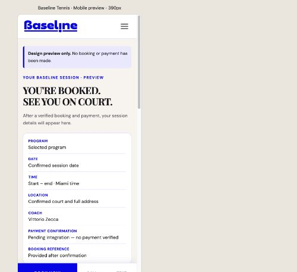

Diseño preparado; datos de ejemplo descriptivos, sin reserva real. La política y contacto continúan debajo.

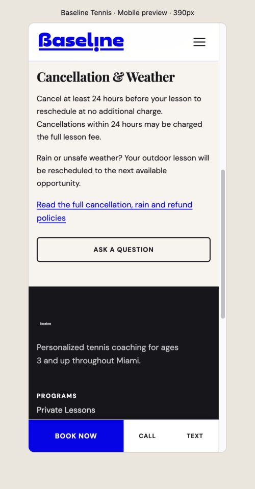

### Estado

Diseño local listo; confirmación automática pendiente de proveedor e integración. Guardado reversible, sin publicar. TRUST / SALES es el encabezado del siguiente grupo de solicitudes.

English summary: Added a mobile confirmation preview with all requested session fields and existing cancellation/weather policy. No payment is verified, no real booking is shown; provider integration remains pending.

## Solicitud 19 Elementos de confianza

### Lo que pediste

Reseñas reales, fotos del coach y de clases, y cifras de experiencia y jugadores entrenados que se puedan respaldar.

### Lo que preparamos

Conservamos Players Love Baseline para reseñas reales y añadimos Meet Your Coach con espacios para un retrato de Vittorio y una foto real dando clase. Añadimos una zona de experiencia y jugadores entrenados marcada como pendiente, sin inventar cifras. El enlace Meet the Coach lleva a su página. En About aclaramos que la foto real sigue pendiente.

### Estado: DISEÑO PREPARADO — CONTENIDO PENDIENTE

- Retrato del coach y fotos reales de clases: faltan archivos aprobados para publicar. No usamos fotos generadas ni de otras personas como si fueran Vittorio.
- Google Reviews: falta el enlace del perfil del negocio y reseñas reales. Testimonios directos: necesitamos texto auténtico y autorización para publicarlo con el nombre acordado.
- Experiencia: confirmar fecha de inicio y si el número representa años de enseñanza, no años jugando.
- Players coached: confirmar total de jugadores únicos y una fuente o registro que lo respalde, evitando contar sesiones como personas.
- Fotos de alumnos: confirmar permiso de publicación; para menores, autorización de su responsable.
- Antes de lanzar: sustituir los placeholders con contenido aprobado o esconder los bloques pendientes. No mostrar estrellas, promedios, números ni datos estructurados de reseñas sin evidencia.

### Evidencia visual

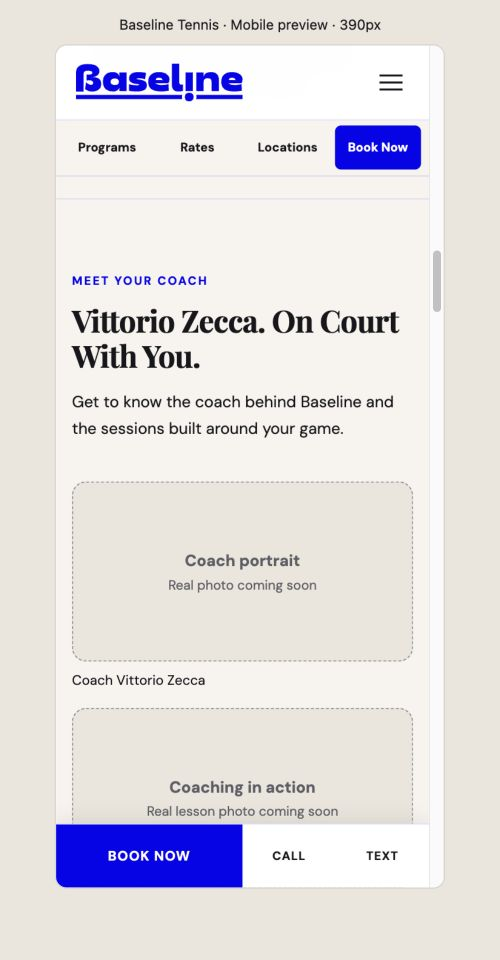

Diseño local con placeholders; todavía no hay fotos reales ni cifras verificadas.

English summary: Added real-photo placeholders and an explicitly pending coaching-record area beside the existing reviews section. Authentic reviews, approved coach/action photos and substantiated numbers are still required. Nothing published.

## Solicitud 20 Meet Your Coach en el inicio

### Lo que pediste

Presentar a Vittorio Zecca, Founder & Head Coach de Baseline Tennis, con foto profesional o en cancha, bio breve y TRAIN WITH VITTORIO o BOOK A LESSON.

### Lo que hicimos

Ampliamos la sección existente, sin duplicarla. Ahora identifica claramente el nombre, cargo y marca. La bio explica coaching personalizado con feedback claro, para adultos y juniors desde principiantes hasta avanzados. Incluye técnica, movimiento, estrategia y match play, con clases privadas, semi-private, clínicas y hitting/sparring. TRAIN WITH VITTORIO abre las opciones de reserva.

### Estado

Texto y CTA implementados. **Foto real pendiente:** el espacio sigue marcado como placeholder hasta recibir una imagen profesional o de acción aprobada por el coach. Reseñas y cifras verificadas siguen pendientes según la solicitud 19. No se publicó.

### Evidencia visual

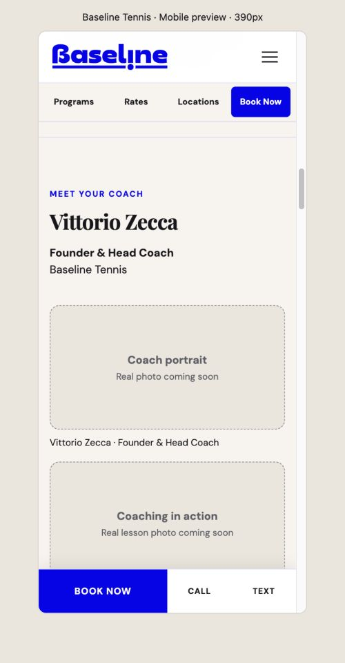

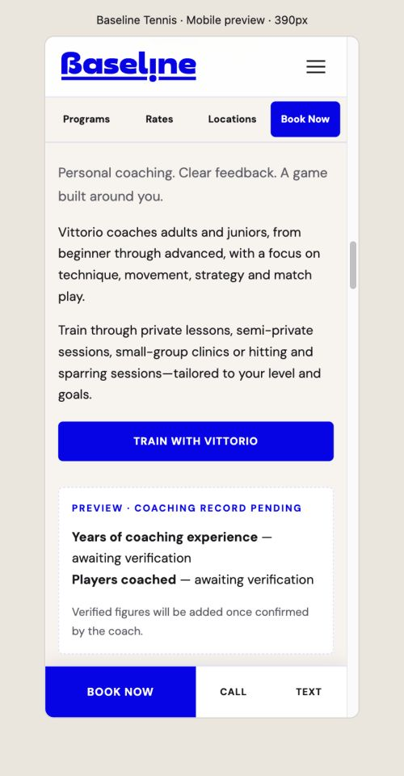

English summary: Updated the existing homepage coach section with Vittorio’s founder/head-coach title, concise coaching bio covering all requested audiences/services/skills, and Train With Vittorio CTA. Real portrait/action photo remains pending.

## Solicitud 21 Perfil completo de Vittorio

### Lo que pediste

Una página personal y premium que explique quién es Vittorio, su experiencia, filosofía, jugadores y servicios, My Coaching Approach (Technique, Movement, Strategy, Match Play) y un cierre Ready to Train con reserva y disponibilidad.

### Lo que hicimos

Ampliamos About, conservando su dirección y SEO de entrenador en Miami. Presenta Vittorio Zecca, Founder & Head Coach de Baseline Tennis. Redactamos una introducción y filosofía en primera persona para su revisión. Incluimos los cuatro pilares solicitados, adultos y juniors desde principiantes hasta avanzados, y enlaces a private, semi-private, clinics y hitting/sparring. Explicamos el valor de entrenar directamente con Vittorio, con feedback claro y práctica orientada al juego. El cierre usa BOOK A LESSON y VIEW AVAILABILITY como se pidió aquí.

### Estado: TEXTO PREPARADO — DATOS PERSONALES PENDIENTES

El coach debe revisar y aprobar el texto en primera persona y enviar su historia, experiencia y credenciales verificables. No inventamos trayectoria, títulos, resultados ni cifras. Fotos profesionales y de acción siguen como placeholders. VIEW AVAILABILITY lleva por ahora a la página de reservas, que indica claramente que el calendario no está activo; se conectará al proveedor después. No se publicó.

### Evidencia visual

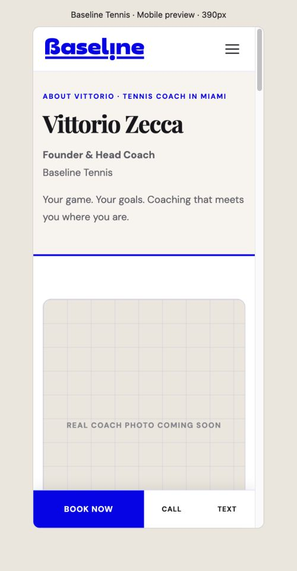

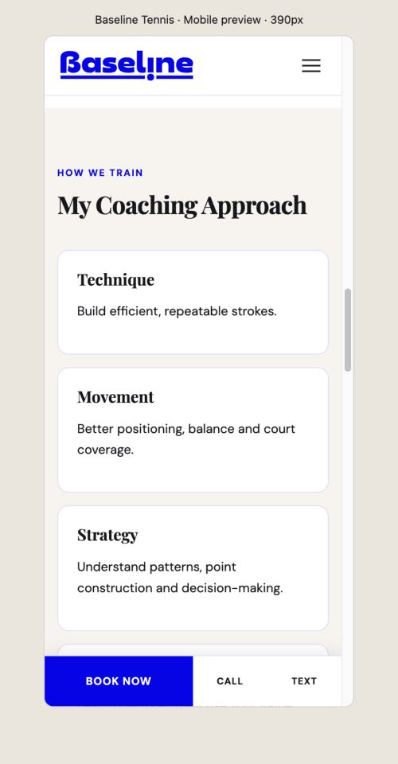

English summary: Expanded the existing About page into a personal coach profile with draft first-person copy, four coaching pillars, audiences/services and final booking actions. Biography, credentials, real photos and live availability remain pending.

## Solicitud 22 Confianza cerca de la reserva

### Lo que pediste

Mensajes pequeños cerca de booking/checkout: Secure Payment via Stripe, Instant Booking Confirmation, Easy Rescheduling y Weather Protection.

### Lo que hicimos

Añadimos un bloque compacto en Booking, justo antes de las opciones de sesión, con los cuatro mensajes y enlace a FAQ & Policies. Stripe y confirmación instantánea están marcados Coming soon porque todavía no están activos. Rescheduling explica que debe solicitarse al coach con al menos 24 horas para cambiar sin cargo adicional. Weather Protection explica que las clases afectadas por lluvia o clima inseguro se reprograman; no promete seguro ni reembolso automático.

### Estado

Diseño listo y revisado en móvil. Pendiente conectar y probar Stripe, confirmaciones y herramientas de cambios antes de quitar los avisos Coming soon. Si el checkout es del proveedor, estos mensajes también deberán configurarse allí, si lo permite. El texto FAQ / POLICIES se toma como encabezado de próximas solicitudes.

### Evidencia visual

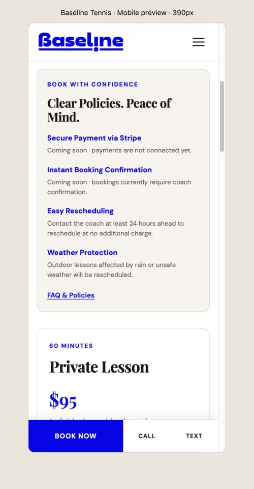

Vista local. Pagos y confirmaciones automáticas pendientes; los mensajes de cambios y clima reflejan la política actual.

English summary: Added compact booking trust messages with explicit coming-soon status for Stripe and instant confirmation, accurate rescheduling/weather terms and a policy link. Actual provider checkout remains pending.

## Solicitud 23 Políticas definitivas y preparación de lanzamiento

### Lo que pediste

Políticas claras y completas antes de lanzar: cancelación, late cancellation/no-show, lluvia, costos de cancha, reembolsos, vencimiento de paquetes y autorización para juniors. No publicar mensajes que parezcan un negocio incompleto. Priorizar Google → confianza → precio → disponibilidad → pago → confirmación.

### Estado: PENDIENTE DE DECISIONES DEL COACH — NO LISTO PARA LANZAR

Los términos existentes son un borrador de trabajo, no una nueva aprobación del coach. No inventamos cobros, vencimientos ni condiciones. La página de políticas conserva el texto existente y ahora termina con BOOK NOW y ASK A QUESTION. Las preguntas pendientes están en este documento interno, no se agregaron como políticas públicas.

### Decisiones que necesitamos

1. **Cancellation window:** confirmar si se mantienen las 24 horas actuales, cómo solicitar un cambio y la zona horaria aplicable.
2. **Late cancellation / no-show:** definir el cargo exacto o pérdida de crédito, si se aplica siempre, tolerancia por retraso y qué pasa cuando alguien no asiste. El borrador solo dice que una cancelación tardía puede cobrarse completa; no define no-show.
3. **Rain / weather:** confirmar quién decide, cómo se avisa, qué pasa si llueve con la clase empezada y cómo se reprograma. El borrador ofrece reprogramación por lluvia o clima inseguro.
4. **Court fees:** confirmar si están incluidos en cada precio o se cobran aparte, con importe o regla clara por cancha.
5. **Who pays court reservation fees:** definir quién reserva y quién paga, incluidos cargos no reembolsables de la cancha. Mostrar el total antes del pago.
6. **Refunds:** confirmar reglas para sesiones sin usar, cancelaciones del coach y clases no reprogramables, además del texto existente sobre clases completadas y revisión excepcional de paquetes. Definir cómo y cuándo se tramita un reembolso.
7. **Package expiration:** definir vigencia del paquete de diez, cuándo empieza a contar, extensiones por clima y tratamiento de clases restantes. No se ha definido un vencimiento.
8. **Junior waiver:** el coach debe proporcionar el texto aprobado y el proceso de consentimiento del padre/madre o responsable. Definir cómo se registra y conserva la aceptación. No se redactó ni activó un waiver en esta tarea.

### Regla para el sitio público

Antes de publicar, sustituir todos los placeholders con contenido aprobado o retirar los bloques que sigan pendientes. Esto incluye Coming soon, awaiting verification, fotos pendientes, reseñas pendientes, notas de revisión y el diseño de confirmación. No borrar avisos de pagos pendientes mientras el flujo siga inactivo: primero conectar y probar o mantener la publicación bloqueada. Nunca usar la página de ejemplo como confirmación real.

Aplicar las políticas finales de forma consistente en Policies, Booking, checkout del proveedor, confirmación y emails. Mantener datos de pago/confirmación fuera de buscadores; revisar el dominio y la indexación de las páginas comerciales al lanzar.

### Secuencia de conversión: qué está listo y qué falta

- **Google:** contenido y títulos enfocados en Miami preparados. Dominio final, indexación y configuración de búsqueda pendientes del lanzamiento.
- **Confianza:** perfil y diseño preparados. Fotos, reseñas reales y datos de experiencia pendientes.
- **Precio:** servicios principales visibles. Precios definitivos de Tennis 101/201 y costos de cancha pendientes.
- **Disponibilidad:** integración, canchas y agenda del coach pendientes.
- **Pago:** proveedor y Stripe pendientes de conectar y probar.
- **Confirmación:** diseño preparado; reserva/pago verificados, emails y calendario pendientes.

### Evidencia visual

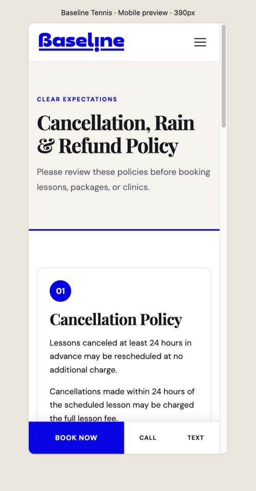

Esta imagen documenta el borrador actual, NO políticas definitivas aprobadas. La lista de decisiones pendientes queda en este reporte para el coach. La estética Club Modern y las acciones de reserva se conservan.

English summary: Final policies remain a launch blocker. Existing policy copy is retained pending coach decisions; added booking/contact actions at the end. All unfinished-content markers must be resolved or hidden before publication, without disguising inactive booking/payment features. Nothing published.

## Ajuste posterior: sin reservas por email

Retiramos el formulario que preparaba un correo y los redireccionamientos de reserva al contacto. BOOK NOW y JOIN PROGRAM permanecen, con selección del programa y un aviso claro de que el sistema todavía no está activo. Los enlaces públicos del proveedor se podrán configurar después. El correo de la marca sigue como contacto para preguntas.

Revisamos 13 páginas: enlaces y anchors locales, IDs, un H1 por página, JSON de datos estructurados y sintaxis de JavaScript. Pasaron las pruebas de las seis selecciones y destinos HTTPS. Corregimos la tolerancia a configuración incompleta y eliminamos código de formulario que ya no se usa. No hubo errores de consola en la vista de reserva comprobada. No se probaron pagos reales porque no están conectados.

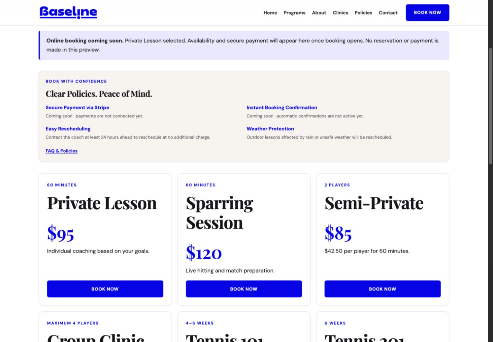

Cambios guardados localmente; sin publicar.

## Adición visual: Why Tennis?

Adaptamos los cuatro diseños enviados a una sección final del inicio, después de las zonas de Miami. Reemplaza el cierre genérico y conserva BOOK NOW y ASK A QUESTION. Usa el azul, tipografía y espaciado de Club Modern; el contenido es texto real, legible en móvil y accesible a buscadores, sin cargar cuatro imágenes grandes.

Incluye los mensajes sociales, actividad, concentración, juego competitivo y aire libre, y termina con “And somehow… it always starts at the Baseline.” Adaptamos “Your heart loves it” a “You get moving” para mantener el enfoque en actividad y evitar prometer un resultado de salud. Los precios y las reservas siguen primero en la página.

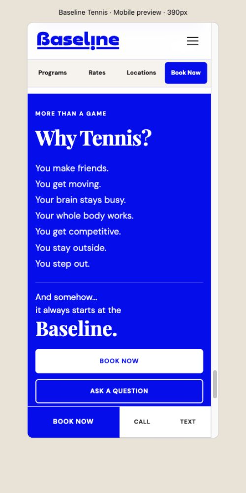

Implementado localmente y reversible. Sin publicar.

## Fotos reales incorporadas

La foto de Vittorio con la raqueta junto a la red se usa como retrato en Meet Your Coach y About. La foto golpeando la pelota aparece como imagen de acción en ambas páginas. Conservamos los originales enviados sin modificar; el encuadre se adapta con el diseño de la web. Las imágenes cargan de forma diferida y tienen texto alternativo descriptivo. No se presentan como evidencia de una clase con alumnos.

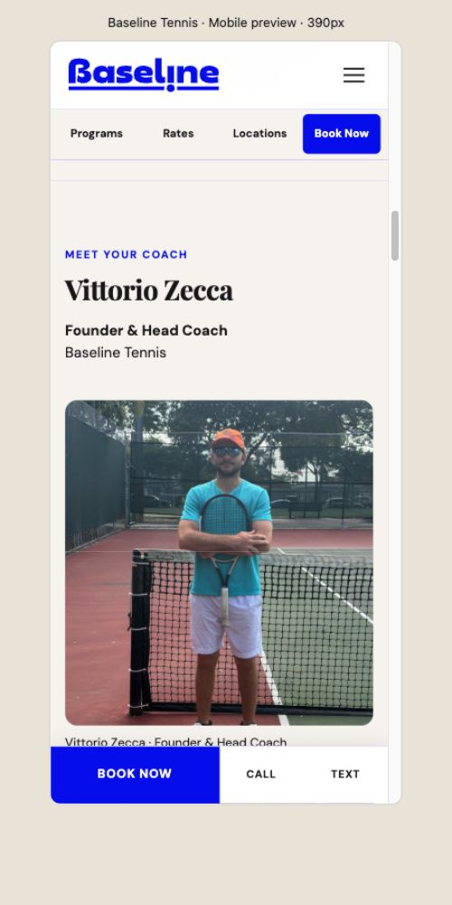

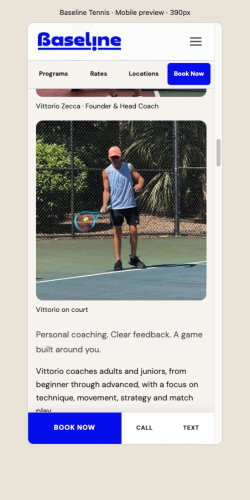

Estado: incorporadas localmente y revisadas en móvil. Reseñas y datos de experiencia siguen pendientes. Sin publicar.

## Galería y video de cancha

Incorporamos las siete fotos nuevas y el video IMG_6632.MOV en Home y About, en una sección On Court después de Meet Your Coach. Video con reproducción manual, controles y formato vertical respetado. Galería horizontal deslizable en móvil, con varias fotos visibles en escritorio. Conservamos el orden de precios y reserva antes de esta sección.

Las fotos se exportaron a WebP con orientación corregida y tamaño reducido para la web; los originales no se modificaron. Las imágenes cargan de forma diferida y el video no se descarga automáticamente al abrir la página. El video suministrado dura aproximadamente 2.4 segundos; se comprobó reproducción completa en el navegador local. No es un montaje ni un video de larga duración.

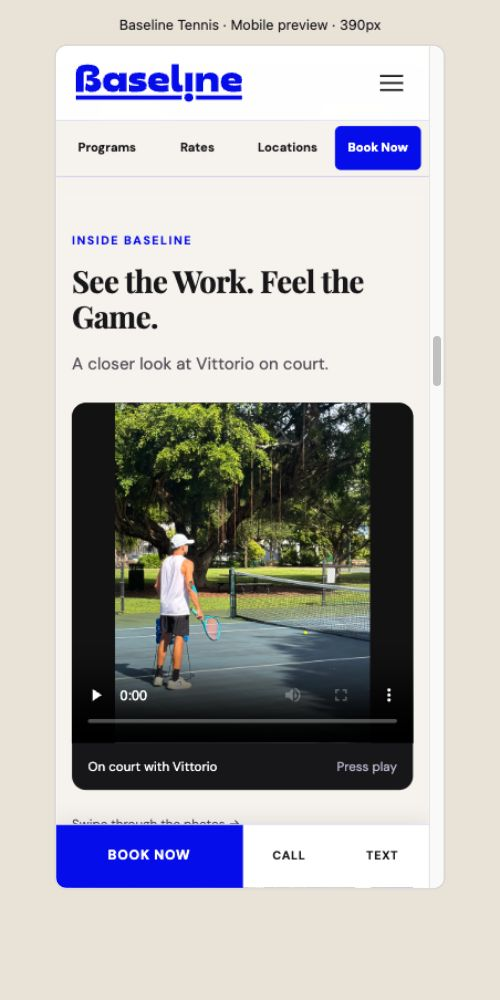

Cambios locales y reversibles. Sin publicar.

## Revisión posterior a publicación — alineación del coach

Bio y acciones centradas en una columna. Meet the Coach agrupado debajo de Train With Vittorio como enlace secundario. Caja de cifras pendiente centrada: dos columnas en escritorio y una en móvil. Solo local, pendiente de aprobación para publicar.

### Alineación de ubicaciones

Se centraron las tarjetas de Miami, los textos y los botones. Dos columnas en escritorio con South Miami centrado debajo; una columna compacta en móvil. Solo local, pendiente de publicación.

### Photos & Video — simplificación

Se retiró el botón Train With Vittorio de la sección de fotos y video a petición de Ron. Solo local.

### Programs & Packages — sin duplicación

Se eliminaron las cuatro tarjetas de servicios repetidas de Programs. Ahora Programs & Packages contiene solo Tennis 101, Tennis 201 y el paquete de 10 clases. Los servicios individuales conservan precios, reserva y Explore en Choose Your Session. Solo local, pendiente de publicación.

### More Than a Game — composición centrada

Se centraron el cierre y los botones. Seis beneficios en dos columnas en escritorio y una en móvil; “You stay outside” y “You step out” se combinaron en “Step outside. Try something new.” Solo local, pendiente de revisión.

### Local modernization preview — October 4, 2026
- Removed the Book Now link beside the homepage On this page dropdown.
- Rounded homepage lesson cards and standardized their border thickness for equal inner button widths.
- Added shared actions.css across all 13 pages: pill-shaped action buttons, consistent 52px minimum height, padding and typography; equal-width paired actions, stacked on phones.
- Shared floating rounded Book Now / Call / Text bar across mobile pages, including safe-area spacing and footer clearance. Desktop retains its existing navigation.
- Local only, awaiting visual approval before publishing. Menus and FAQ disclosures retain their control styles; general text links remain text links.
- Homepage header preview: rounded floating header, hamburger menu on phone/desktop, existing five section shortcuts grouped under Explore this page; separate section-nav row removed. Destination heading focus and Escape focus return supported. Desktop menu opening and location shortcut verified; iframe preview click automation was unavailable. Local only.
- Extended the floating header and hamburger to all 13 pages using shared header.css. Inner-page Explore Baseline shortcuts return to homepage sections; active-page navigation labels are preserved. Mobile booking page visually checked; all-page static checks pass. Not published.
- Centered all menu links and labels; added gentle hover/press feedback with reduced-motion support. October 4 regression checks passed; corrected keyboard focus timing after section navigation. Local only.
